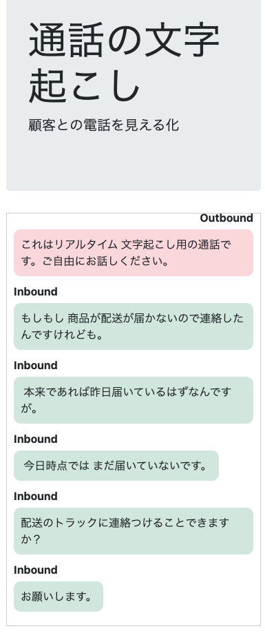

# 音声リアルタイム文字起こしのTwilioサーバーレス用コード  

## 概要
このコードは、Twilio Programmable Voiceのリアルタイム文字起こしを体験できるサンプルコードです。
TwilioのFunctions & Assetsで動作するものなので、Twilioアカウントがあれば手軽にデモを動作させることが可能です。  

## 条件  
1. Twilioのアカウントを持っていること
2. Twilio CLIが利用可能なこと
3. Twilio CLIのServerlessプラグインが導入済みであること
4. SyncのDocumentの設定が完了していること
5. Twilio上で利用可能な電話番号があること

## 導入手順  
1. .envファイルへ必要な変数の登録    
   - Account SID  
     - Twilioコンソール内にあります。ACの頭文字で始まる文字列です。  
   - Auth_Token  
     - Twilioコンソール内にあります。パスワードのような扱いになっています  
   - API_KEY　　
     - API Keyをコンソールで生成してください　　
   - API_SECRET　　
     - API Keyを生成時にSecretが表示されます。　　
   - SYNC_SERVICE_SID 
     - TwilioコンソールでSYNCのサービスを作成してください
   - SYNC_DOCUMENT_NAME  
     - 作成したSyncサービスの中でDocumentを作成してください。Documentの名前は「transcriptionData」としてください。

2. コードのデプロイ  
   1. コマンドプロンプトでプロジェクトの直下に移動
   `cd RealtimeTranscriptionDemo`
   2. プロファイルの確認  
   `twilio profiles:list`  
   3. プロファイルの切り替え  
   `twilio profiles:use <対象のプロファイル>`  
   4. デプロイ  
   `twilio serverless:deploy`  

3. Twiml Binの作成
   1. コンソールにログインしてTwiml Binを新規作成してください。
   2. 名前は自由に設定して下さい
   3. Twimlは下記のコードを利用して下さい。  
   コードのデプロイ後に表示されたFunctionsのURLをコピーして　「statusCallbackUrl="https://<FunctionsのURL>/main"」に置き換えして下さい。  
```xml
<?xml version="1.0" encoding="UTF-8"?>
<Response>
  <Start>
    <Transcription 
      name="Callcenter"
      statusCallbackUrl="https://<FunctionsのURL>/main"
      languageCode="ja-JP"
      track="both_tracks"
      inboundTrackLabel="customer"
      outboundTrackLabel="agent" 
      transcriptionEngine="google"
      speechModel="telephony"
      profanityFilter="true"
      partialResults="false"
      enableAutomaticPunctuation="true"
    />
  </Start>
          <Say language='ja-JP' voice='Google.ja-JP-Standard-D'>これはリアルタイム文字起こし用の通話です。ご自由にお話下さい。</Say>
    <Gather input="speech" timeout="5">
    </Gather>
</Response>
```

4. 購入した電話番号に３で作成したTwiml Binを設定してください。


## デモ実施手順  
1. ブラウザでFunctions & AssetsにデプロイしたIndex.htmlに対してアクセスしてください。
2. 購入した電話番号に自分の電話から架電してください
3. 機械音声が流れたあとに自由にお話下さい
4. 喋っている内容がリアルタイムでブラウザ上に表示されます  
  
